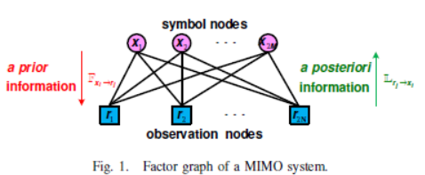

[TOC]

# 模型

$$
\mathbf{y=Hx+n}
$$

 目的:==在得到$\mathbf{y}$时，推测出$\mathbf{u}$。==

调制方式：$\Omega$,里面有K个符号

---

# 检测准则

## 最大后验(MAP)

> 最大后验：P(H|E)，E是evidence/Data，是已知的。后验是H的函数  [Bayes interfece][https://en.wikipedia.org/wiki/Bayesian_inference]

$\hat{\mathbf{x}}_{\rm MAP}=\arg \max\limits_sP(x|y)$

## 最大似然(ML)

$\hat{\mathbf{x}}_{\rm ML}=\arg \max\limits_sP(y|x)$

## 最小均方误差(MMSE)

$\hat{\mathbf{x}}_{\rm MMSE}=\arg \min\limits_s||\mathbf{x}-\hat{\mathbf{x}}||$

针对MMSE的推导过程，**待补充**

# 基于MMSE的算法

## AOR-famlily(显式)

待补充

## SD-family(隐式)

待补充

# 基于ML的算法

## Sephere-decoding

# 基于MAP的算法

## EP

## AMP

##  BP

###  	图模型：

### 	推理过程

$$
\begin{aligned}
p(x_i|H,y)&=\sum_{\mathbf{x}\backslash x_i} p(x_1,x_2,\cdots,x_{N_t}|H,y)\\
\end{aligned}
\\
$$

> ==上式是联合概率推导边缘概率公式而来的==

从symbol nodes(SN)到observation nodes(ON)传递的是先验概率

从ON到SN传递的是后验概率

首先，将system model从复数域，变为实数域。

> 牵扯到向量和矩阵的复数域到实数域映射。

实数域下

1. $\mathbf{y}$尺寸为$2N_r \times 1$

2. $\mathbf{H}$尺寸为$2N_t\times 2N_r$

3. $\mathbf{x,n}$尺寸均为$2N_t \times 1$
4. $\Omega$ 变为$\{ (-\sqrt{Q}+1),\cdots,-1,1,\cdots,(+\sqrt{Q}-1) \}$

> ==idea:有没有多帧共同处理的可能性？==

#### SN端

计算先验概率的LLR：
$$
\mathbf{\alpha}^{(l)}_{s_i\rightarrow y_j}=\{\alpha^{(l)}_{i,j}(s_1),\alpha^{(l)}_{i,j}(s_2),\cdots,\alpha^{(l)}_{i,j}(s_{\sqrt{Q}-1})\}
$$
这是从第$i$个SN到第$j$个ON传递的信息, 

==$i=1,2,\cdots,N_t$==

==$j=1,2,\cdots,N_r$==

其中每个分量计算：

$$
\alpha^{(l)}_{i\rightarrow j}(s_k)=\ln\frac{p^{(l)}(x_i=s_k)}{p^{(l)}(x_i=s_0)}，k=1,2,\cdots,\sqrt{Q}-1
$$
也就是对于对于第$i$个SN(用户)，它发射的这个symbol等于$s_k$的LLR，因此每个i，有$\sqrt{Q}-1$个LLR，作为LLR向量进行传递

#### ON端

计算后验的LLR:

$$
\mathbf{\beta}^{(l)}_{y_j\rightarrow x_i}=\{\beta^{(l)}_{j,i}(s_1),\beta^{(l)}_{j,i}(s_2),\cdots,\beta^{(l)}_{j,i}(s_{\sqrt{Q}-1})\}
$$
这是第$j$个ON向第$i$个SN传递的信息

其中第$k$个元素计算如下：

$$
\beta^{(l)}_{j,i}(s_k)=\ln\frac{p^{(l)}(x_i=s_k|y_j,\mathbf{H})}{p^{(l)}(x_i=s_0|y_j,\mathbf{H})},k=1,2,\cdots,\sqrt{Q}-1
$$
利用贝叶斯定理，得

==有可能是并不是计算完整的后验概率，等待学习sum-product论文== 、

下面的推导仅供参考

$$
\begin{equation}
\begin{aligned}
\beta^{(l)}_{j,i}(s_k)&=\ln\frac{p^{(l)}(x_i=s_k|y_j,\mathbf{H})}{p^{(l)}(x_i=s_0|y_j,\mathbf{H})}\\
%%&=\ln\frac{p^{(l)}(x_i=s_k,y_j|\mathbf{H})/p^{(l)}(y_j|\mathbf{H})}{p^{(l)}(x_i=s_0,y_j|\mathbf{H})/p^{(l)}(y_j|\mathbf{H})}\\
%%&=\ln\frac{p^{(l)}(y_j|x_i=s_k,\mathbf{H})\cdot p^{(l)}(x_i=s_k|\mathbf{H})}{p^{(l)}(y_j|x_i=s_0,\mathbf{H})\cdot p^{(l)}(x_i=s_0|\mathbf{H})}\\
%%&=\ln\frac{p^{(l)}(y_j|x_i=s_k,\mathbf{H})\cdot \sum\limits_{\mathbf{X}}  }{}
&=\ln\frac{\sum_{\mathbf{X:}x_i=s_k}p^{(l)}(\mathbf{x}|y_j,\mathbf{H})}{\sum_{\mathbf{X:}x_i=s_0}p^{(l)}(\mathbf{x}|y_j,\mathbf{H})} , 这是联合概率与边缘概率推导\\  
&=\ln\frac{\sum\limits_{\mathbf{X:}x_i=s_k}p^{(l)}(y_j|\mathbf{x,H})p^{(l)}(\mathbf{x}|\mathbf{H})/p^{(l)}(y_j|\mathbf{H})}{\sum\limits_{\mathbf{X:}x_i=s_0}p^{(l)}(y_j|\mathbf{x,H})p^{(l)}(\mathbf{x}|\mathbf{H})/p^{(l)}(y_j|\mathbf{H})}，这是贝叶斯公式\\
&=\ln\frac{\sum\limits_{\mathbf{X:}x_i=s_k}p^{(l)}(y_j|\mathbf{x,H})p^{(l)}(\mathbf{x})}{\sum\limits_{\mathbf{X:}x_i=s_0}p^{(l)}(y_j|\mathbf{x,H})p^{(l)}(\mathbf{x})}
\end{aligned}
\end{equation}
$$

 

**实际上：**
$$
\begin{equation}
\begin{aligned}
\beta^{(l)}_{j,i}(s_k)&=\ln\frac{p^{(l)}(x_i=s_k|y_j,\mathbf{H})}{p^{(l)}(x_i=s_0|y_j,\mathbf{H})}\\
&=\ln\frac{\sum\limits_{\mathbf{X:}x_i=s_k}p^{(l)}(y_j|\mathbf{x,H})p^{(l)}(\mathbf{x}^{2N_t\backslash i})}{\sum\limits_{\mathbf{X:}x_i=s_0}p^{(l)}(y_j|\mathbf{x,H})p^{(l)}(\mathbf{x}^{2N_t\backslash i})}\\
&=\ln\frac{\sum\limits_{\mathbf{X:}x_i=s_k}p^{(l)}(y_j|\mathbf{x,H})\prod\limits_{1,t\neq i}^{N_t}p(x_t=s_m)}
{\sum\limits_{\mathbf{X:}x_i=s_0}p^{(l)}(y_j|\mathbf{x,H})\prod\limits_{1,t\neq i}^{N_t}p(x_t=s_m)}，这一步有近似：x_i间相互独立。 注：\prod指的是给定x_i=s_k时，各个x_{i'}的取值情况\\
&=\ln\frac{\sum\limits_{\mathbf{X:}x_i=s_k}p^{(l)}(y_j|\mathbf{x,H})\prod\limits_{1,t\neq i}^{N_t}p^{(l)}(x_t=s_0)\exp \alpha_{t,j}^{(l-1)}(s_m)}{\sum\limits_{\mathbf{X:}x_i=s_0}p^{(l)}(y_j|\mathbf{x,H})\prod\limits_{1,t\neq i}^{N_t}p^{(l)}(x_t=s_0)\exp \alpha_{t,j}^{(l-1)}(s_m)}\\
&=\ln\frac{\sum\limits_{\mathbf{X:}x_i=s_k}p^{(l)}(y_j|\mathbf{x,H})\exp\sum\limits_{1,t\neq i}^{N_t}\alpha_{t,j}^{(l-1)}(s_m)}{\sum\limits_{\mathbf{X:}x_i=s_0}p^{(l)}(y_j|\mathbf{x,H})\exp\sum\limits_{1,t\neq i}^{N_t}\alpha_{t,j}^{(l-1)}(s_m)}\\
\end{aligned}
\end{equation}
$$
下面计算似然$p^{(l)}(y_j|\mathbf{x,H})$:，其实==这里也假设了接收端是独立的==
$$
\begin{equation}
\begin{aligned}
y_j&=h_{j,i}x_i+\sum\limits_{k=1,k\neq i}^{2N_t}h_{j,k}x_k+n_j\\
&=h_{j,i}x_i+z_{j,i}+n_j\\
\end{aligned}
\end{equation}
$$
如果使用Gaussian approximation(==GAI==)，有：
$$
\begin{equation}
\begin{aligned}
\mu_{z_{j,i}}&=\sum\limits_{k=1,k\neq i}^{2N_t}h_{j,k}\mathbb{E}\{x_k\},\\
\sigma^2_{z_{j,i}}&=\sum\limits_{k=1,k\neq i}^{2N_t}h_{j,k}^2{\rm Var}\{x_k\}
\end{aligned}
\end{equation}
$$
因此，
$$
p(y_j|\mathbf{x,H})=\frac{1}{\sqrt{2\pi}\sigma_{z_{j,i}}}\exp\{-\frac{(y_j-h_{j,i}x_i-\mu_{z_{j,i}}-0)^2}{2\sigma^2_{z_{j,i}}}\}
$$
将上式带回$\beta$计算式，得
$$
\begin{equation}
\begin{aligned}

\beta_{j,i}^{(l)}(s_k)
&=\ln \frac{\sum\limits_{\mathbf{X}:x_i=s_k}\exp(-\frac{(y_j-h_{j,i}x_i-\mu_{z_{j,i}}^{(l-1)})^2}{2(\sigma^{(l-1)}_{z_{j,i}})^2})\exp\sum\limits_{1,t\neq i}^{N_t}\alpha_{t,j}^{(l-1)}(s_m)}
{\sum\limits_{\mathbf{X}:x_i=s_0}\exp(-\frac{(y_j-h_{j,i}x_i-\mu_{z_{j,i}}^{(l-1)})^2}{2(\sigma^{(l-1)}_{z_{j,i}})^2})\exp\sum\limits_{1,t\neq i}^{N_t}\alpha_{t,j}^{(l-1)}(s_m)}\\
&=\ln \sum\limits_{\mathbf{X}:x_i=s_k}\exp(-\frac{(y_j-h_{j,i}x_i-\mu_{z_{j,i}}^{(l-1)})^2}{2(\sigma^{(l-1)}_{z_{j,i}})^2})\exp\sum\limits_{1,t\neq i}^{N_t}\alpha_{t,j}^{(l-1)}(s_m)
-\ln{\sum\limits_{\mathbf{X}:x_i=s_0}\exp(-\frac{(y_j-h_{j,i}x_i-\mu_{z_{j,i}}^{(l-1)})^2}{2(\sigma^{(l-1)}_{z_{j,i}})^2})\exp\sum\limits_{1,t\neq i}^{N_t}\alpha_{t,j}^{(l-1)}(s_m)}\\
&=\max\limits_{\mathbf{X}:x_i=s_k}(\sum\limits_{1,t\neq i}^{N_t}\alpha_{t,j}^{(l-1)}(s_m)-\frac{(y_j-h_{j,i}x_i-\mu_{z_{j,i}}^{(l-1)})^2}{2(\sigma^{(l-1)}_{z_{j,i}})^2})-\max\limits_{\mathbf{X}:x_i=s_0}(\sum\limits_{1,t\neq i}^{N_t}\alpha_{t,j}^{(l-1)}(s_m)-\frac{(y_j-h_{j,i}x_i-\mu_{z_{j,i}}^{(l-1)})^2}{2(\sigma^{(l-1)}_{z_{j,i}})^2}),这一步用了Jacobi近似\\
&=\frac{(y_j-h_{j,i}s_0-\mu_{z_{j,i}}^{(l-1)})^2}{2(\sigma^{(l-1)}_{z_{j,i}})^2}
-\frac{(y_j-h_{j,i}s_k-\mu_{z_{j,i}}^{(l-1)})^2}{2(\sigma^{(l-1)}_{z_{j,i}})^2}\\
&=\frac{h_{j,i}^2(s_0^2-s_k^2)+2h_{j,i}(y_j-\mu_{z_{j,i}}^{(l-1)})(s_k-s_0)}{2(\sigma^{(l-1)}_{z_{j,i}})^2}

\end{aligned}
\end{equation}
$$
也就是：

==$\beta_{j,i}^{(l)}(s_k)=\frac{h_{j,i}^2(s_0^2-s_k^2)+2h_{j,i}(y_j-\mu_{z_{j,i}}^{(l-1)})(s_k-s_0)}{2(\sigma^{(l-1)}_{z_{j,i}})^2}$==

